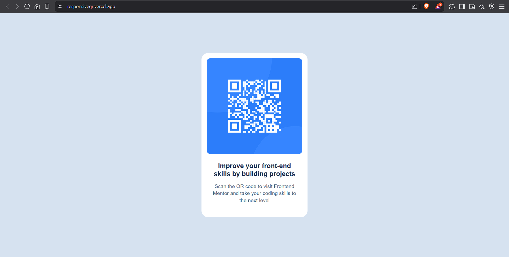
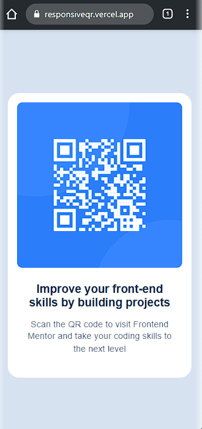

# Frontend Mentor - QR code component solution

This is a solution to the [QR code component challenge on Frontend Mentor](https://www.frontendmentor.io/challenges/qr-code-component-iux_sIO_H). Frontend Mentor challenges help you improve your coding skills by building realistic projects. 

## Table of contents

- [Overview](README-template.md#overview)
  - [Screenshot](README-template.md#screenshot)
  - [Links](README-template.md#links)
- [My process](README-template.md#my-process)
  - [Built with](README-template.md#built-with)
  - [What I learned](README-template.md#what-i-learned)
  - [Continued development](README-template.md#continued-development)
  - [Useful resources](README-template.md#useful-resources)
- [Author](README-template.md#author)
- [Acknowledgments](README-template.md#acknowledgments)

## Overview

### Screenshot

### Links

- Live Site URL: [responsiveqr.vercel.app](https://responsiveqr.vercel.app/)

## My process

### Built with

- Semantic HTML5 markup
- CSS custom properties
- Flexbox
- Responsive Web Design
- Media Queries

### What I learned

I learned to use Figma to get design details, such as font size, padding etc. I could also get used to media queries and responsive web design.

## Author

- Website - [Amal Raj](https://amalraj.vercel.app)
- Frontend Mentor - [@amalraj28](https://www.frontendmentor.io/profile/amalraj28)
- Instagram - [@amal_raj28](https://www.instagram.com/amal_raj28)

